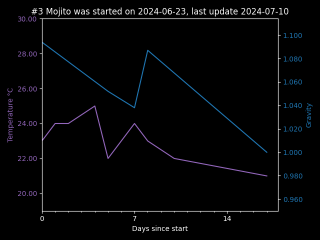

<h1> #3 Mojito </h1>

Started on: 2024-06-23 | Running Concurrently with: [#4 Orange and Chilli](4_Orange_and_Chilli.md)


<hr>

Plan & Ingredient List

| Ingredient | Planned<br/>Quantity  | Final<br/>Quantity                                    |
|------------|-----------------------|-------------------------------------------------------|
| Honey      | 1865g (1211g + 654g)  | 1211 + 654?g scales didn't want to cooperate over 2kg |
| Water      | 3427g                 | 3420g                                                 |
| Lime Juice | 3 limes               | 3 limes                                               | 
| Lime Zest  | 3 limes               | 3 limes                                               | 
| Mint       | 8 mint leaves (small) | 5 mint leaves (small)                                 |

- After brewing additions:
    - Mint for some time during secondary if needed
    - Rum to complete the 'Mojito' flavour
        - planning to use a non-spiced rum, possibly an over-proof white rum

<h3>Yeast</h3>

- [17% dry mead Wyeast](https://www.themaltmiller.co.uk/product/wyeast-4021-dry-white-sparkling/?v=79cba1185463)
    - Half a packet (2-3x recommended)

Yeast Food:

- feed #1
    - Fermaid K: 2.5 grams at pitch
        - Done 2024-06-23
- feed #2
    - Fermaid O: 3 grams day 3
        - Done 2024-06-27
        - caused quite the energetic reaction, had to replace the bubbler
- feed #3
    - Fermaid O: 3 grams at addition of Honey - at or below 1.050 grav
      - Done 2024-07-03

## Expectations

- Start gravity
    - Expected:1.137
    - Actual: 1.094 before step 1 honey addition
- Final gravity
    - Expected:1.000
    - Actual:
- ABV
    - Expected: 16.0%
    - Actual:

<h2>Fermentation Data</h2>

| Date       | Temperature  °C | Gravity | PH  | Notes                     |
|------------|-----------------|---------|-----|---------------------------|
| 2024-06-23 | 23.00           | 1.094   |     |                           |
| 2024-06-24 | 24.00           |         |     |                           |
| 2024-06-25 | 24.00           |         |     |                           |
| 2024-06-27 | 25.00           |         |     |                           |
| 2024-06-28 | 22.00           | 1.052   |     |                           |
| 2024-06-30 | 24.00           | 1.038   |     |                           |
| 2024-07-01 | 23.00           | 1.087   |     | Estimated blended gravity |
| 2024-07-03 | 22.00           |         |     |                           |
| 2024-07-10 | 21.00           | 1.000   |     |                           |
|            |                 |         |     |                           |
|            |                 |         |     |                           |
|            |                 |         |     |                           |
|            |                 |         |     |                           |
|            |                 |         |     |                           |
|            |                 |         |     |                           |
|            |                 |         |     |                           |



notes:

- 2024-06-24 aerated for 3 minutes with a drill attachment
- 2024-06-25 aerated again, likely for the final time
- 2024-06-30 added honey #2, 5 mins of swirling got some of it into suspension, need a better plan for next time
- 2024-07-19 Syphoned to **Secondary** it's been long enough on the lees, will leave it in the glass demijohn for a few months
  - somewhat irritating to syphon with the amount of free-floating lime bits, should leave things in larger pieces next time

```
Mead Calculation for 4.75 litres of product
	Start gravity (required) 1.137 
	Final gravity (sweetness) 1.000 
	Expected ABV 18.0% 
Ingredients: 
	Water 3.427KG 3.427L 
	Total Honey 1.865KG 1.304L
	Lime 100g, (1.5 fruit) 98ml 1.016grav 
	Mint 1g, (4.0 leaves) 1ml 1.000grav 
	Honey 1211g, 844ml 1.435grav initial honey addition
	Honey 654g, 455ml 1.435grav Step 1 added at 1.050grav
Nitrogen requirement (YAN): 519.02ppm * 4.75L = 2465.34mg
	Nitrogen Source: 2.5g @ 100.0ppm = 250.0mg  - Name: Fermaid K - contains inorganic nitrogen
	Nitrogen Source: 3.0g @ 40.0ppm = 120.0mg  - Name: Fermaid O - add last
	Nitrogen Source: 3.0g @ 40.0ppm = 120.0mg  - Name: Fermaid O - add last
Current Nitrogen Load: 490.00 
Required Nitrogen Load: 519.02
```

``` python
    print()
    mead = Mead(18, 1.000, product_weight=4.75, step_feeding=True)
    mead.add_ingredient("Lime", g=100)
    mead.add_ingredient("Mint", 0.15*4)
    mead.set_nitrogen_demand_medium()
    mead.add_nitrogen_source("Fermaid K", 2.5)
    mead.add_nitrogen_source("Fermaid O", 3.0)
    mead.add_nitrogen_source("Fermaid O", 3.0)
    print(mead)
```
