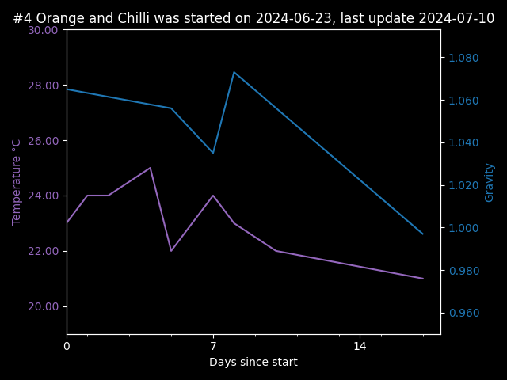

<h1> #4 Orange and Chilli</h1>

Started on: 2024-06-23 | Running Concurrently with: [#3 Mojito](3_Mojito.md)


<hr>

Plan & Ingredient List

| Ingredient       | Planned<br/>Quantity | Final<br/>Quantity |
|------------------|----------------------|--------------------|
| Honey            | 1312g (895g + 453g)  | 895 + 496g         |
| Water            | 3788g                | 3780g              | 
| Orange Juice     | 250g                 | 2 oranges (250g)   |
| Orange Zest      | 3 Oranges            | 3 Oranges          | 
| Red Chilli       | 75g                  | 2 chillis (35g)    |
| Red Chilli Seeds | 2.5g                 | 1 chilli worth     |

<h3>Yeast</h3>

- [17% dry mead Wyeast](https://www.themaltmiller.co.uk/product/wyeast-4021-dry-white-sparkling/?v=79cba1185463)
    - Half a packet (2-3x recommended)

Yeast Food:

- feed #1
    - Fermaid K: 2.5 grams at pitch
        - Done 2024-06-23
- feed #2
    - Fermaid O: 3 grams day 3
        - Done 2024-06-27
        - a small reaction, I think this is going to be a slower brew, possibly due to the chilli?
- feed #3
    - Fermaid O: 3 grams at addition of Honey - at or below 1.050 grav
        - Done 2024-07-03

## Expectations

- Start gravity
    - Expected:1.132
    - Actual: 1.065 before step 1 honey addition
- Final gravity
    - Expected:1.010
    - Actual:
- ABV
    - Expected: 16.0%
    - Actual:

<h2>Fermentation Data</h2>

| Date       | Temperature  °C | Gravity | PH | Notes                     |
|------------|-----------------|---------|----|---------------------------|
| 2024-06-23 | 23.00           | 1.065   |    |                           |
| 2024-06-24 | 24.00           |         |    |                           |
| 2024-06-25 | 24.00           |         |    |                           |
| 2024-06-27 | 25.00           |         |    |                           |
| 2024-06-28 | 22.00           | 1.056   |    |                           |
| 2024-06-30 | 24.00           | 1.035   |    |                           |
| 2024-07-01 | 23.00           | 1.073   |    | Estimated blended gravity |
| 2024-07-03 | 22.00           |         |    |                           |
| 2024-07-10 | 21.00           | 0.997   |    |                           |



notes:

- 2024-06-24 aerated for 3 minutes with a drill attachment
- 2024-06-25 aerated again, likely for the final time
- 2024-06-30 added honey #2, 5 mins of swirling got some of it into suspension, need a better plan for next time
- 2024-07-19 Syphoned to **Secondary** it's been long enough on the lees, will leave it in the glass demijohn
  for a few months
    - Syphoning did not go perfectly, some smaller pieces in the mix got syphoned up

<h3>Stabilization plan</h3>

- Completed: 2024-08-03
- Potassium Metabisulfite: 0.15g
- Potassium Sorbate : 0.2g

<h2> Post Ferment back sweetening</h2>
- Added on 2024-10-14
- 100g Honey Water Solution @ 2:1 or 66.6g Honey, and 33.3g Water

Tasting Notes:

- dry before back sweetening
- pre 2024-10-14 changes
    - Smells slightly of tomatoes
    - still has mild scent of rocket fuel, should dissapate with time
    - no spice from the chilli at-all
    - very little orange taste
- post 2024-10-14 changes
    - still a little dry, we only added about 66 grams of honey to around 4 litres of mead
    - Moving the sediment made the chilli flavour stronger
        - we may decide to add some of the leftover sediment to the bottles, it'll depend on a second tasting in a week
    - chilli flavour is plesant without being overpowering

Serving thoughts:
-  

## End Quantities:

note: smells unplesant, slightly like bad fermentation, we're hoping that will go away with time

| 2024-10-19 | Container (g) | Total (g) | Liquid (g) | 
|------------|---------------|-----------|------------|
| 2L Jar     | 1038          | 2893      | 1855       | 
| 1L Jar     | 633           | 1386      | 753        | 
| 1lL Bottle | 603           | 1618      | 1015       | 
| Total      |               |           | 3623       | 

```
Mead Calculation for 4.75 litres of product
	Start gravity (required) 1.132 
	Final gravity (sweetness) 1.010 
	Expected ABV 16.0% 
Ingredients: 
	Water 3.788KG 3.788L 
	Total Honey 1.312KG 0.917L
	Orange 250g, (2.0 fruit) 234ml 1.067grav 
	Red Chillis 75g Grav = N/A
	Honey 859g, 598ml 1.435grav initial honey addition
	Honey 453g, 316ml 1.435grav Step 1 added at 1.050grav
Nitrogen requirement (YAN): 501.16ppm * 4.75L = 2380.52mg
	Nitrogen Source: 2.5g @ 100.0ppm = 250.0mg  - Name: Fermaid K - contains inorganic nitrogen
	Nitrogen Source: 3.0g @ 40.0ppm = 120.0mg  - Name: Fermaid O - add last
	Nitrogen Source: 3.0g @ 40.0ppm = 120.0mg  - Name: Fermaid O - add last
Current Nitrogen Load: 490.00 
Required Nitrogen Load: 501.16

```

``` python
    print()
    mead = Mead(16, 1.010, product_weight=4.75, step_feeding=True)
    mead.add_ingredient("Orange", g=250)
    mead.set_nitrogen_demand_medium()
    mead.add_nitrogen_source("Fermaid K", 2.5)
    mead.add_nitrogen_source("Fermaid O", 3.0)
    mead.add_nitrogen_source("Fermaid O", 3.0)
    print(mead)
```
